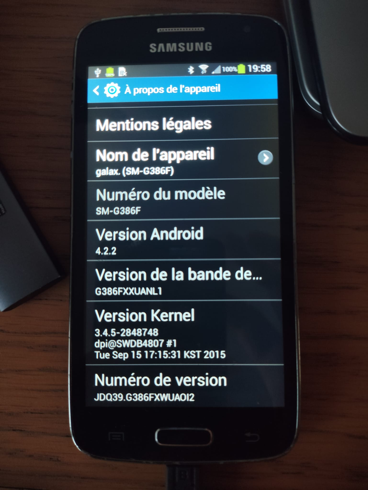
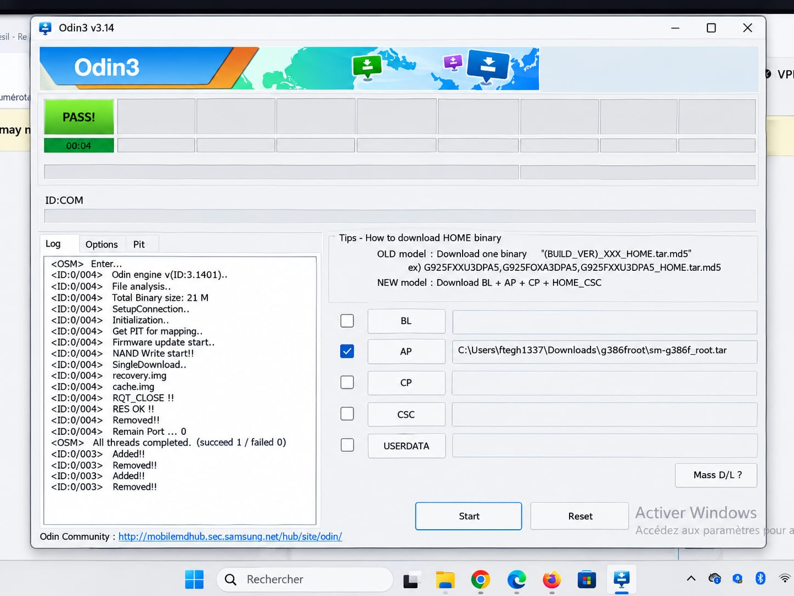

# android-servers

Technical notes and scripts for the Samsung Galaxy Core LTE SM-G386F on Android 4.2.2.

## Layout

| Path | Contents |
|---|---|
| `scripts/` | device-side and PC-side tooling |
| `firmware/` | local Odin root package: `sm-g386f_root.tar` |
| `docs/` | procedure notes and external links |
| `img/` | screenshots |

## Root

Use Odin on Windows:

- Odin: https://odindownload.com/download/
- root archive: `firmware/sm-g386f_root.tar`

### Procedure

1. Power off the phone.
2. Hold Volume Down + Home + Power.
3. Release when Download Mode appears.
4. Connect USB.
5. Open Odin on Windows.
6. Load `firmware/sm-g386f_root.tar` in the **AP** slot.
7. Start flashing.
8. Wait for **PASS**.
9. Reboot.
10. Verify: `adb shell` then `su`.

### Screenshots





## Archive check

```bash
tar -tf firmware/sm-g386f_root.tar
```

A valid Odin tar usually contains partition images such as `recovery.img` and `cache.img`.
If the archive is missing expected files or comes from an unknown source, do not use it.

## Debloat

`tools` are in `scripts/debloat-422.sh`.

- `list`: show package presence
- `review`: show APK paths and reclaimable size
- `freeze`: safe reversible disable
- `remove`: rename APKs to `.bak` and free space
- `restore`: restore `.bak` files and re-enable packages

Do not remove core system packages: Play Store, GMS, GSF, SystemUI, Phone, Settings, CSC, Knox, and the home launcher.

## Useful scripts

| Script | Role |
|---|---|
| `scripts/debloat-422.sh` | debloat and package review |
| `scripts/space-clean.sh` | cleanup and reclaim space |
| `scripts/install-acc.sh` | ACC install flow |
| `scripts/ssh-doctor.sh` | SSH / devpts / dropbear diagnostics |
| `scripts/heal-pts.sh` | fix poisoned PTY state |
| `scripts/install-recovery.sh` | boot-hook persistence helper |

## ACC

ACC is used for charge limiting on this device.

- project: https://github.com/VR-25/acc
- details: [docs/acc-switch-procedure.md](docs/acc-switch-procedure.md)

## External references

See [docs/external-links.md](docs/external-links.md) for Odin, firmware mirrors, BusyBox, mksh, AOSP, and related references.

## Android / mksh references

- mksh: https://www.mkshell.org/
- mksh mirror: https://github.com/ndk-project/mksh
- Wikipedia: https://en.wikipedia.org/wiki/MKSH
- AOSP: https://source.android.com/

Check before deleting **any** `/system/lib` file:

```bash
python3 scripts/walk-deps.py    # walks DT_NEEDED of the syspull/ tree
```

### Lesson 2 — TouchWiz IS the home screen; Google's launcher pkg is a stub

`com.google.android.launcher` on this device is version "1.3.large" and only
contains `StubApp` + `LauncherRedirectionProvider` — **no HOME activity**.
After removing SecLauncher3 the system reached "System now ready" with zero
`android.intent.category.HOME` activities → bootanim never exits,
`mFocusedActivity: null`, `sys.boot_completed` stays empty.

Verify a real launcher before removing:

```sh
dumpsys package com.google.android.launcher   # look for MAIN/HOME filter entries
```

### Lesson 2b — Java-side `System.loadLibrary` is invisible to ELF analysis

The Samsung keyboard (SamsungIME / DIOTEK IME) loads
`libswiftkeysdk-java.so` from Java. `walk-deps.py` (DT_NEEDED walk) cannot see
that link. Symptom: "Clavier Samsung s'est arrêté" popup loop, logcat shows
`UnsatisfiedLinkError ... Lcom/touchtype_fluency/SwiftKeySDK;` from
`InputControllerImpl.initInputEngine`. Fix = restore the lib, then open a text
field; verify with `dumpsys input_method` (a `curSession=SessionState{...}`
must appear).

### Lesson 3 — diagnosis flow that worked

```sh
getprop sys.boot_completed            # empty = stuck
getprop init.svc.media                # 'restarting' = crash-loop
dmesg | grep init:                    # exit codes of dying services
/system/bin/mediaserver               # run by hand -> linker errors
logcat -d | grep 'Waiting for service'
dumpsys activity | grep mFocusedActivity   # null = no HOME resolved
```

### Lesson 4 — a poisoned `/dev/pts` breaks SSH tty sessions; heal it lazily, don't kill

Dropbear's pty setup silently depends on the kernel's devpts being sane. After
enough zombie shells accumulate (sessions dropped while the phone suspended),
fresh pty allocations get shadowed: `TIOCSCTTY` fails (EPERM), mksh input
arrives mangled (`sh: syntax error: '(' unexpected`), or the slave node simply
doesn't exist (`/dev/pts/N: No such file or directory`). Diagnosis flow that
worked: read `dropbear.err` for the failing session → identify the signature →
`ls /dev/pts` for stale nodes owned by dead adb sessions. **Heal = lazy
remount** (`umount -l` + fresh mount), not a reboot, and not `kill`: Chainfire
`su` SIGKILLs all its descendants the instant its client disconnects (that
killed the heal script twice before switching to `umount -l`).

---

## 10. Troubleshooting notes

| Symptom | Cause / fix |
|---|---|
| `adb devices` empty / `unauthorized` from PC | cable/driver, or the **RSA prompt** (4.2.2 is the first Android with it) — revoke authorizations in Developer options and replug |
| `ssh: Connection refused` | network OK but **nothing listening on 2222** → start SimpleSSHD; check Wi-Fi sleep policy (keep Wi-Fi on during sleep = Always) |
| `Permission denied (password)` + `dropbear.err` says `no authorized keys` | key is in the wrong place — it must be `/data/data/org.galexander.sshd/files/authorized_keys`, owned by the app uid (§6) |
| SimpleSSHD starts then the process disappears | restart via `am startservice -n org.galexander.sshd/.SimpleSSHDService` and read `dropbear.err`; if it keeps dying, reinstall the APK (native libs live in `/data/app-lib/org.galexander.sshd-*/`) |
| Interactive ssh: `sh: syntax error: '(' unexpected` then connection closes | poisoned devpts (§6 Reliability fix): stale tty holders shadow fresh pty nodes, input arrives mangled (truncated `$((...` = `(` error). Fix: `adb shell "su -c 'sh /sdcard/ssh-doctor.sh --nuclear'"` (or `sh /sdcard/heal-pts.sh` as root) — lazy devpts remount, no reboot needed; prevented by the wake lock in `/system/etc/install-recovery.sh` |
| **Warp terminal only**: `sh: syntax error: '(' unexpected` | Warp's **SSH Wrapper** injects a Bash/Zsh bootstrap script ("Warpify") incompatible with Android's `mksh`. Fix: bypass with `command ssh g386f` (or `/usr/bin/ssh g386f`), or disable the SSH Wrapper in Warp (*Settings > Features > SSH*) |
| ssh session dies instantly with no output; `dropbear.err` shows `/dev/pts/N: No such file or directory` + `open /dev/tty failed` | devpts index/node desync on the 3.x kernel — a fresh pty gets a name whose node doesn't exist. Same heal: `sh /sdcard/heal-pts.sh`. Also triggered by piped-stdin `ssh -tt host 'cmd'` (client anti-pattern) — real terminals are fine |
| Background/detached jobs started via `su` die when the adb session ends | Chainfire `su` SIGKILLs all descendant processes when its client disconnects — `nohup`/`setsid` don't survive it. Keep the session open for the job's lifetime, or make the job not need to outlive `su` |
| `ioctl(TIOCSCTTY): Operation not permitted` in `dropbear.err` | benign on this kernel — logged on every pty session, including the successful ones; ignore unless sessions actually fail |
| `ssh: connect ... timed out` | wrong IP (DHCP moved) → `netcfg | grep wlan0` |
| PC rsync: `unexpected end of file` / `io_read_*` | fallout of the failed ssh connection; disappears once sshd listens |
| Boot stuck on animation, `sys.boot_completed` empty | see §9: dying `media` service (missing lib) or no HOME activity; diagnose with lesson 3, repair via §8 |
| "Clavier Samsung s'est arrêté" loop | missing `libswiftkeysdk-java.so` (§9 lesson 2b) |
| `rm` fails silently / "Read-only file system" despite rw remount | Samsung security APKs need `busybox chattr -i` first (§2 quirks) |
| `df` doesn't drop after big `rm` | ext4 reserved blocks + journal; reboot to reconcile |
| Boot loop after debloat | last-frozen package is usually guilty: `restore`, reboot, re-run without it |
| Distro install: "kernel too old" | glibc vs 3.x kernel → use jessie/Alpine, not stretch+ |
