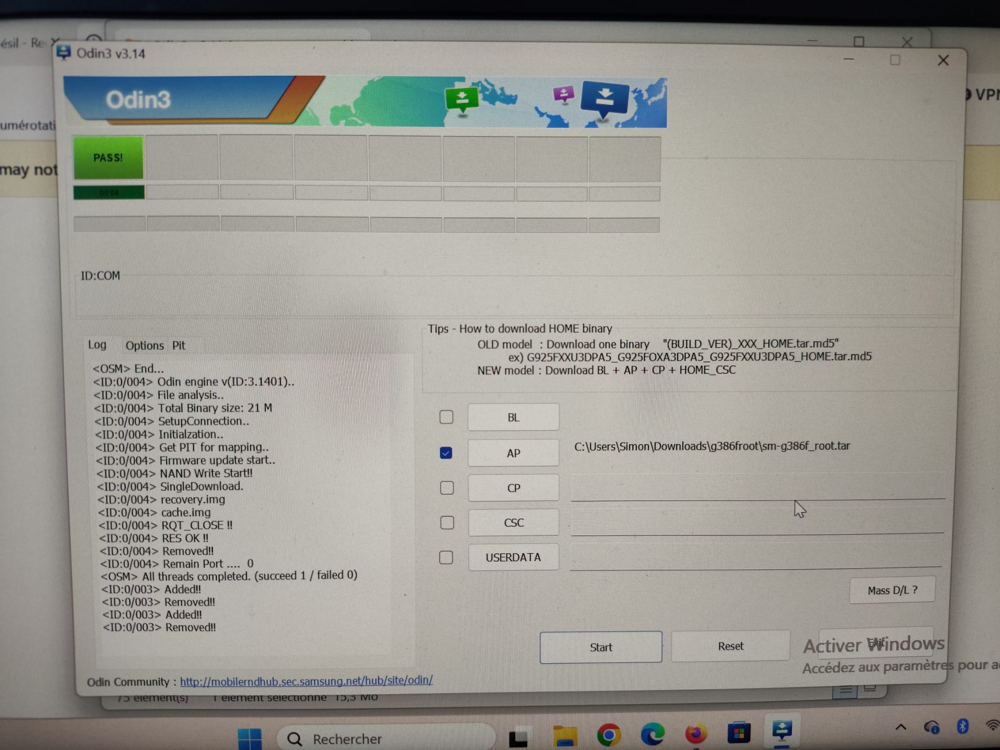

# android-servers

Scripts for debloating and rooting the Samsung Galaxy SM-G386F.

## Root SM-G386F

To root this phone on Windows, download Odin from https://odindownload.com/download/ and use the root archive `sm-g386f_root.tar` with Odin.

### Screenshots




### Quick root procedure

1. Turn the phone off.
2. Press and hold Volume Down, Home, and Power together.
3. Keep holding until the phone vibrate enters Download Mode.
4. Volume up to confirm dl mode
5. Connect the phone to the computer with a USB cable.
6. Open Odin on Windows.
7. Load the root package file `sm-g386f_root.tar` in Odin AP line.
8. Wait for the process to finish.
9. When Odin shows a PASS message, the phone will reboot.
10. After reboot, verify the device is rooted: adb shell and su to get #

### Check the archive is legitimate

If you do not have the original MD5, inspect the tar first:

```bash
tar -tf sm-g386f_root.tar
```

A valid Odin tar usually contains partition images such as `recovery.img` and `cache.img`.

### Scripts

#### `debloat-422.sh`

Debloat script for Android 4.2.2. It can list packages, review installed apps, freeze them, remove them, or restore them.

#### `space-clean.sh`

Cleanup helper script used to free disk space on the device.

#### `sm-g386f_root.tar`

Root package for the Samsung Galaxy SM-G386F.

#### `packages.txt` / `packages.2.txt`

Lists of packages that can be reviewed or used with the debloat script.

